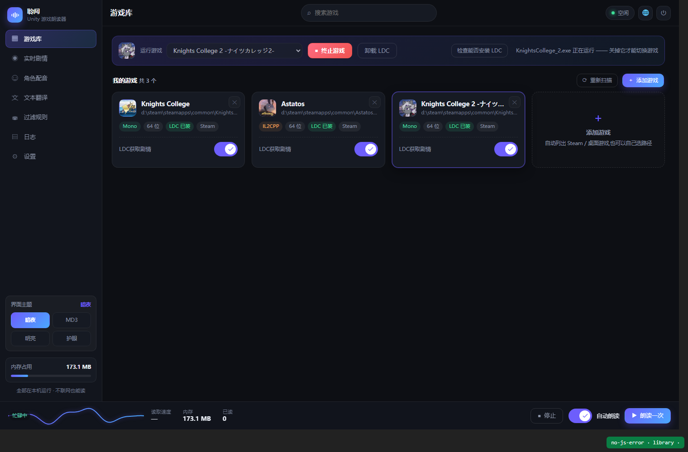
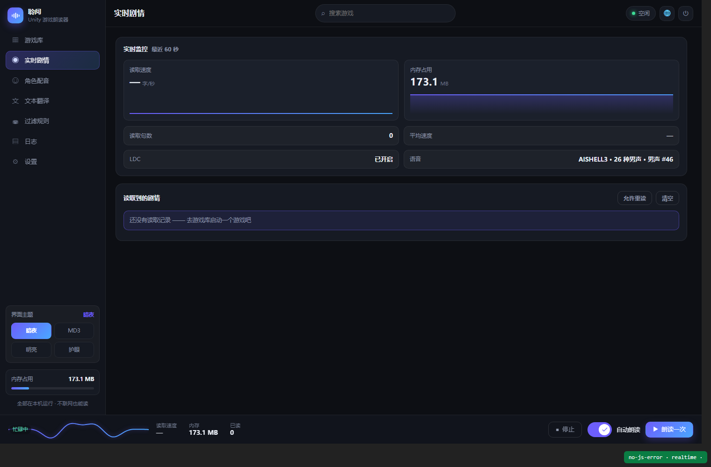
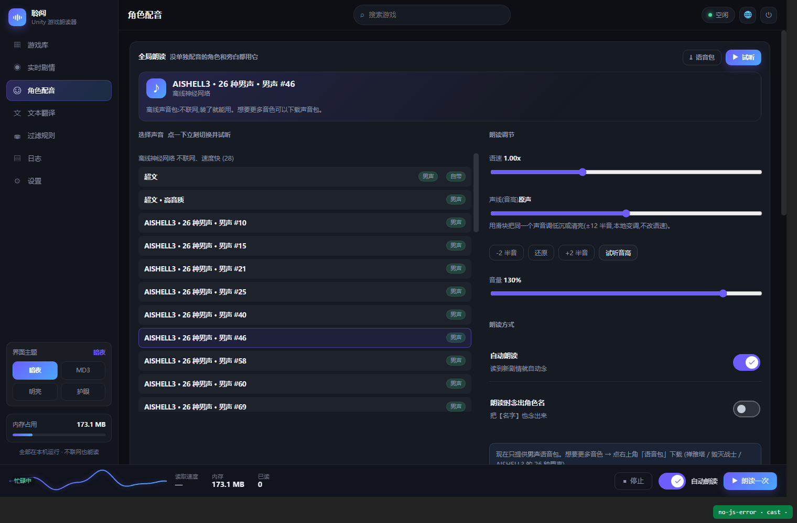
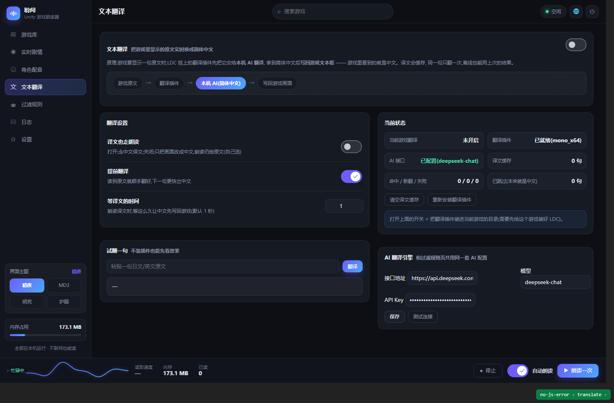
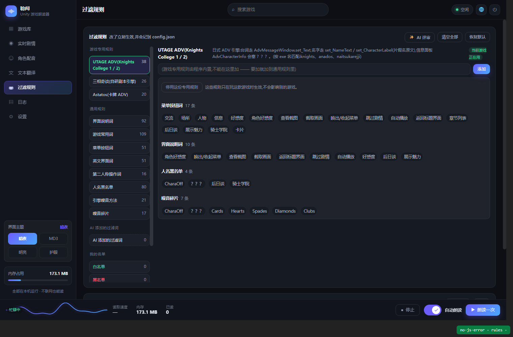
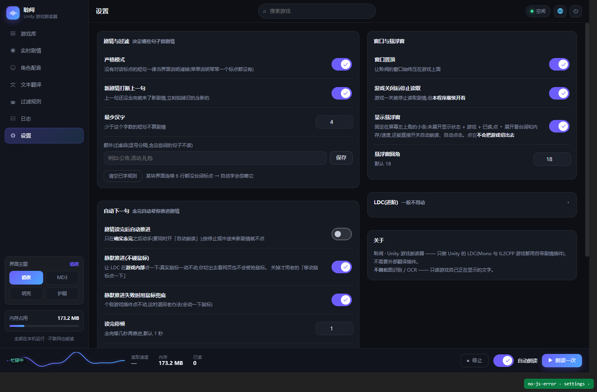
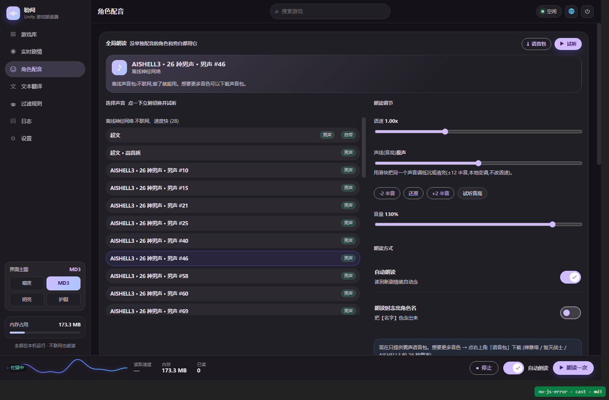
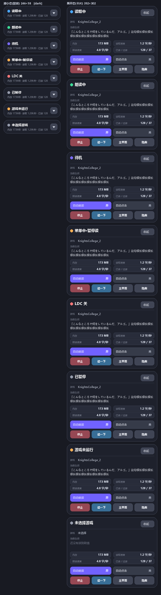
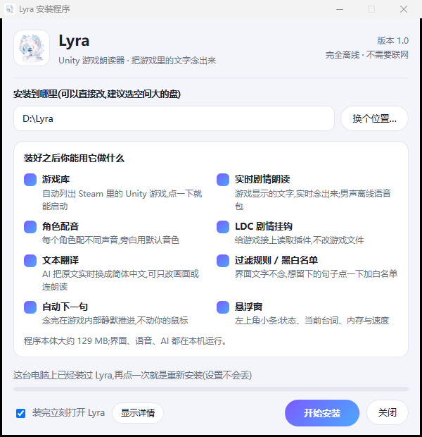
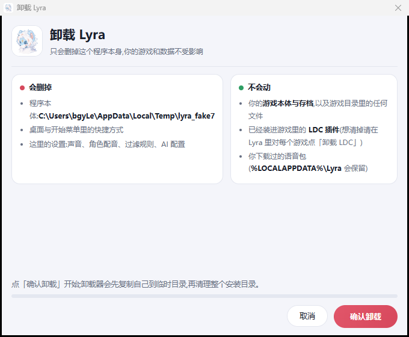

# Lyra · Unity 游戏朗读器

<p align="center">
  
</p>

<p align="center">
  <b>把游戏里的文字念出来 —— 离线朗读 · 角色配音 · AI 实时汉化 · 不改游戏文件</b>
</p>

<p align="center">
  
  
  
  
  
</p>

---

Lyra 是一个写给 **Unity 视觉小说 / ADV 游戏**的桌面朗读器:它从游戏里**读**出正在显示的文字,用**本机语音**念出来,还能顺手用 AI 把它**实时翻成简体中文**再写回游戏画面。整个过程不截图、不 OCR、不碰你的游戏文件。

> 名字取自天琴座(Lyra)。项目早期叫「聆阅」,现已改名 —— 内部数据目录名做了兼容,老用户升级不会丢设置。

## 目录

- [它解决什么问题](#它解决什么问题)
- [功能](#功能)
- [界面](#界面)
- [安装(普通玩家)](#安装普通玩家)
- [从源码构建](#从源码构建)
- [工作原理](#工作原理)
- [项目结构](#项目结构)
- [常见问题](#常见问题)
- [第三方组件](#第三方组件)
- [开发](#开发)
- [免责声明](#免责声明)

## 它解决什么问题

Unity 视觉小说在**显示文字**时,一定会调用引擎的文本接口(`TextMeshPro.SetText`、UTAGE 的 `AdvMessageWindow` 等)。Lyra 的做法是:

1. 用一个自研的 BepInEx 插件(**LDC 剧情挂钩**)在游戏进程里盯住这些接口,把文字与说话人抓出来;
2. 通过日志/文件通道送到 Lyra 主程序;
3. 主程序用过滤规则判断"这句是不是剧情"(界面按钮、菜单、版本号一律不念);
4. 送给本机语音引擎念出来;需要时先过一遍 AI 翻译再写回游戏画面。

没有截图识别,所以**不吃显卡、不出错字、不需要管理员权限**;也没有修改游戏资源,所以**卸载干净、不封号**。

## 功能

| 功能 | 说明 |
|---|---|
| **游戏库** | 自动列出 Steam / 桌面上的 Unity 游戏,识别 Mono / IL2CPP 与位数,一键启动、一键装挂钩 |
| **LDC 剧情挂钩** | 自研 BepInEx 插件,不改游戏文件;Mono 与 IL2CPP 都有对应版本,自动挑选注入方式 |
| **实时剧情朗读** | 文字一出现就念;支持语速、音高、音量,自动跳过界面文字 |
| **角色配音** | 每个角色单独指定声音(旁白可用默认音色),按名字自动区分说话人 |
| **离线男声语音包** | 内置「超文」;可下载更多男声包(sherpa-onnx),全部本机推理,不联网 |
| **文本翻译** | 接入任意 OpenAI 兼容接口(如 DeepSeek),中文原文不动、只替换外文;可选"译文也念出来" |
| **AI 用量统计** | 记录 token 与估算花费,单价可自己填 |
| **过滤规则** | 通用规则 + 每款游戏的专用规则(内置 UTAGE、三相奇谈、Astatos 等档案),可暂停/恢复/清空 |
| **黑白名单** | 日志里点一句就能加白(一定念)或加黑(彻底拉黑),AI 也能代你添加 |
| **自动下一句** | 念完自动推进剧情:**静默方式**(不动鼠标)为主,失败自动退回点击兜底 |
| **悬浮窗** | 置顶小条:状态、当前台词、内存与读取速度;胶囊/卡片两种形态,可拖动、可换角 |
| **主题** | 暗夜 / 明亮 / 护眼 / **Material 3**(按官方设计令牌实现),窗口与悬浮窗一起变色 |

## 界面

| 游戏库 | 实时剧情 |
|---|---|
|  |  |

| 角色配音 | 文本翻译 |
|---|---|
|  |  |

| 过滤规则 | 设置 |
|---|---|
|  |  |

| MD3 主题 | 悬浮窗 |
|---|---|
|  |  |

安装程序与卸载程序也是同一套网页界面(WebView2 渲染,失败自动回退系统界面):

| 安装 | 卸载 |
|---|---|
|  |  |

## 安装(普通玩家)

1. 到 [Releases](../../releases) 下载 **`Lyra 安装程序.exe`**;
2. 双击运行 —— 它是**离线安装包**(约 130 MB,已内置便携 Python 运行环境与语音包,不需要联网);
3. 选安装目录(默认 `D:\Lyra`,装到 C 盘、U 盘都行),点「开始安装」;
4. 装完打开 Lyra → 在游戏卡片上点 **「安装 LDC」** 给这款游戏接上挂钩 → 点「启动游戏」;
5. 进游戏看到对话,它就开始念了。悬浮窗可以随时暂停/继续。

**卸载**:运行安装目录里的 `卸载 Lyra.exe`。它只删自己(`D:\Lyra` 之类),**不会动你的游戏、存档**;已经装进游戏里的 LDC 想清掉,在 Lyra 里对每个游戏点「卸载 LDC」。

## 从源码构建

### 需要

| 组件 | 版本 | 说明 |
|---|---|---|
| Windows | 10 / 11 x64 | |
| Python | 3.11+ | 构建脚本用它跑打包与图标生成 |
| MinGW-w64 (gcc / g++) | 支持 C++17 | 编译窗口宿主、安装器、卸载器 |
| .NET SDK | 6+ | 编译两个 BepInEx 插件 |
| WebView2 SDK | 任意近期版本 | `installer/build/webview2/`(由构建脚本自动下载) |

### 步骤

```powershell
git clone https://github.com/<你的名字>/lyra.git
cd lyra

# 1) 拉运行环境与第三方负载(体积大,不进 Git 仓库):
#    - voices/     内置离线语音包(放 .onnx + tokens.txt)
#    - payload/    XUnity.AutoTranslator 与 BepInEx 可再发行文件
#    详见 voices/README.md 与 payload/README.md

# 2) 编译插件(生成到 hooks/ 下,再由打包脚本收进 payload/)
powershell -File hooks/mono/build.ps1
powershell -File hooks/il2cpp_src/build.ps1

# 3) 打包安装程序(产物:Lyra 安装程序.exe)
powershell -File installer/build.ps1
```

产物是**单文件安装包**;同一个 exe 装好之后双击就是启动器。静默安装:

```powershell
"Lyra 安装程序.exe" --install D:\Lyra
```

## 工作原理

```
┌──────────────────────── 游戏进程 ────────────────────────┐
│  Unity 游戏  →  LDC 剧情挂钩(BepInEx 插件)               │
│                    │ 抓 TextMeshPro / UTAGE 的文本接口    │
└────────────────────┼─────────────────────────────────────┘
                     │ 插件日志(制表符分隔:type / method / text)
                     ▼
        ┌──────────  Lyra 主程序(Python + WebView2)  ──────────┐
        │  过滤判定  →  黑白名单  →  角色识别                    │
        │      ├─ 朗读:sherpa-onnx / Windows SAPI / Edge TTS   │
        │      └─ 翻译:AI 接口 → 写回游戏画面(XUnity 通道)      │
        │  悬浮窗 / 实时剧情 / 日志  ← 状态回传                  │
        └──────────────────────────────────────────────────────┘
                     │ 静默推进:写请求文件 + 读回执
                     ▼
              游戏内部 InputSendMessage(不动鼠标)
```

- **Mono 游戏**:自带 `StoryHook.dll`(BepInEx 5);
- **IL2CPP 游戏**:`StoryHookIl2Cpp.dll`(BepInEx 6 + Harmony);
- 注入用代理 DLL(`winhttp.dll` / `version.dll` / `winmm.dll`),不需要装 doorstop 启动器;
- 静默推进是**直接调游戏内部的输入入口**,不是模拟鼠标 —— 你切出去看网页也不会被抢鼠标(适配报告见 [`docs/dev/`](docs/dev/))。

## 项目结构

```
lyra/
├── core/                 朗读引擎核心(Python)
│   ├── storyhook.py      日志解析 / 过滤规则 / 游戏档案 / 静默推进
│   ├── tts.py            语音合成:SAPI / Edge / sherpa-onnx
│   ├── voices.py         离线语音包目录与下载
│   ├── translate.py      AI 翻译(带磁盘缓存)
│   ├── ai.py             AI 调用与 token/花费统计
│   ├── games.py          游戏扫描与挂钩安装
│   └── floatwin.py       悬浮窗(自绘,PIL)
├── webapp/               主界面(Python 后端 + 原生 HTML/CSS/JS 前端)
│   ├── server.py         本地 HTTP 服务(默认 127.0.0.1:8890)
│   └── static/           前端:6 份 CSS + 10 个 ES 模块,按页拆分
├── hooks/                游戏内插件(C#)
│   ├── mono/             BepInEx 5 版(Mono 游戏)
│   └── il2cpp_src/       BepInEx 6 版(IL2CPP 游戏)
├── installer/            安装包构建(Win32 + WebView2 网页界面)
│   ├── player.cpp        窗口宿主:WebView2 + 拉起后端 + 主题联动
│   ├── setup.c          安装程序(网页界面 + 自动回退)
│   ├── uninstall.c      卸载程序(网页界面 + 自动回退)
│   ├── webui.h          WebView2 宿主(安装器/卸载器共用)
│   └── ui*.html         两个界面页面
├── tools/                开发脚本(截图、离线自检、部署)
├── docs/                 文档、截图、开发记录
└── config.example.json   配置示例(复制成 config.json 使用)
```

## 常见问题

**Q:一定要联网吗?**
不用。朗读、语音包、界面全部在本机;只有你主动开启「文本翻译」并填了 AI 接口时才联网。

**Q:游戏认不出来 / 不出声?**
先看「日志」页有没有文字进来。没有的话:① 确认这款游戏是 Unity 引擎;② 在游戏卡片上点过「安装 LDC」;③ 重启一次游戏。IL2CPP 游戏第一次注入会慢几秒。

**Q:会不会被判作弊 / 封号?**
Lyra 不修改游戏文件、不读写游戏内存中的判定数据,只是**读**显示中的文本。但仍请自行评估联机游戏的使用风险,见[免责声明](#免责声明)。

**Q:静默推进没反应?**
不同引擎的输入入口不一样。Lyra 内置了 UTAGE 的自适应,其它引擎会**自动退回**"移动鼠标点一下"的兜底方式(可在设置里关闭)。

**Q:装到别的盘/U 盘可以吗?**
可以,卸载器跟着程序走。它只会删自己所在的目录 + 快捷方式 + 注册表项,并且有一道安全闸:目录里必须同时存在两个以上 Lyra 特征文件才肯删。

**Q:我的设置在哪?**
`<安装目录>\app\config.json`;下载的语音包在 `%LOCALAPPDATA%\Lyra\voices`。卸载程序不会删语音包。

## 第三方组件

本仓库**只包含 Lyra 自己的源码**。运行时依赖以下第三方组件,它们由安装包携带或由构建脚本下载,各自遵循原许可证:

| 组件 | 用途 | 许可 |
|---|---|---|
| [BepInEx](https://github.com/BepInEx/BepInEx) 5 / 6 | Unity 插件加载框架 | LGPL-2.1 |
| [XUnity.AutoTranslator](https://github.com/bbepis/XUnity.AutoTranslator) | 把译文写回游戏画面 | MIT |
| [sherpa-onnx](https://github.com/k2-fsa/sherpa-onnx) | 离线语音合成 | Apache-2.0 |
| [Microsoft Edge WebView2](https://developer.microsoft.com/microsoft-edge/webview2/) | 界面渲染 | 微软可再发行条款 |
| [Pillow](https://python-pillow.org/) | 悬浮窗绘制 | MIT-CMU |
| 语音包「超文」等 | 离线音色 | 见 `voices/README.md` |

## 开发

- 开发日志与决策记录:[`docs/DEVELOPMENT.md`](docs/DEVELOPMENT.md)
- 引擎适配勘察报告(UTAGE 等):[`docs/dev/`](docs/dev/)
- 自检脚本:`tools/`(离线朗读自检、悬浮窗渲染、窗口截图、热部署)

```powershell
python tools/reader_test.py     # 过滤与解析自检
python tools/float_test.py      # 悬浮窗四套主题渲染总览
python tools/shot_pid.py <pid> out.png
```

## 免责声明

本项目仅供**个人学习与无障碍辅助**使用:帮助阅读困难或语言不通的玩家理解游戏内容。请在你拥有合法授权的游戏上使用,并遵守各游戏的用户协议。作者不对因使用本工具产生的任何后果负责。游戏名称、角色与相关素材版权归各自权利人所有。
