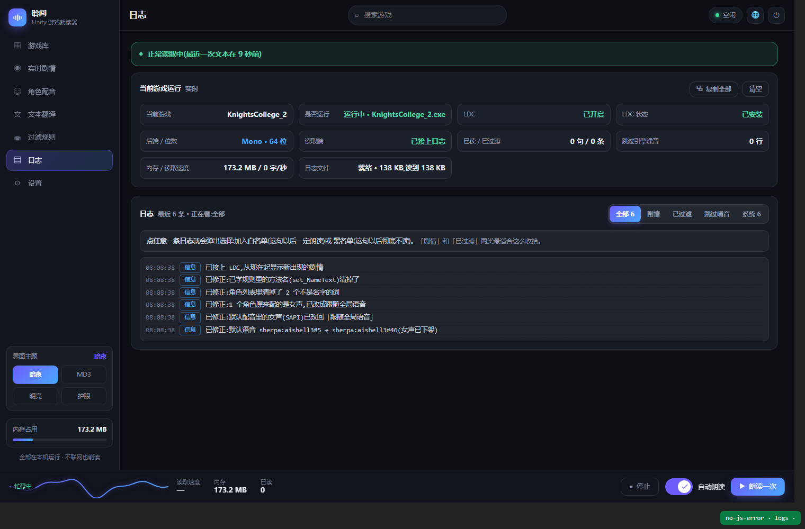
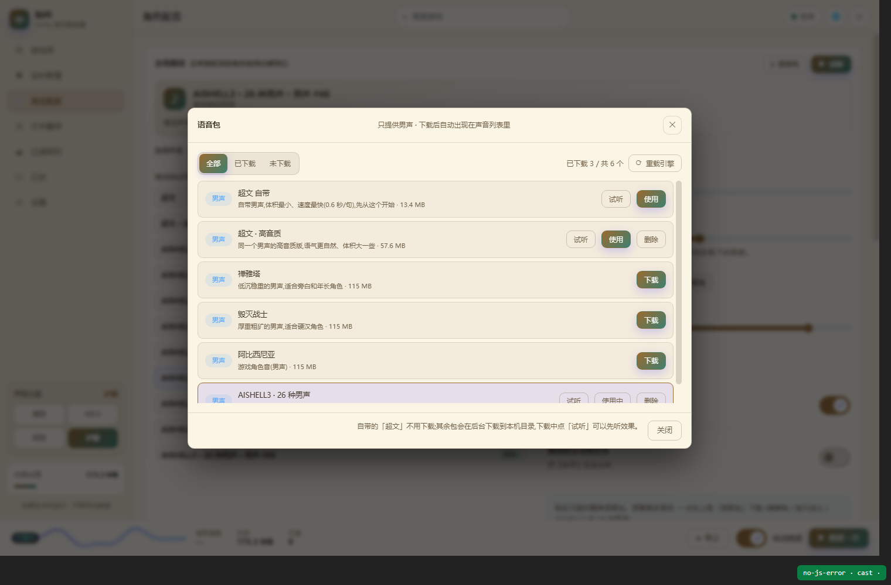
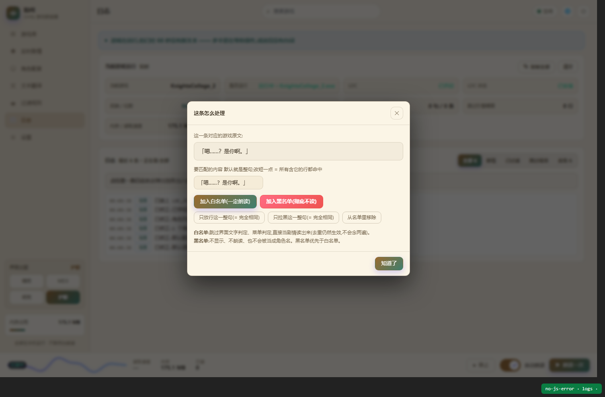
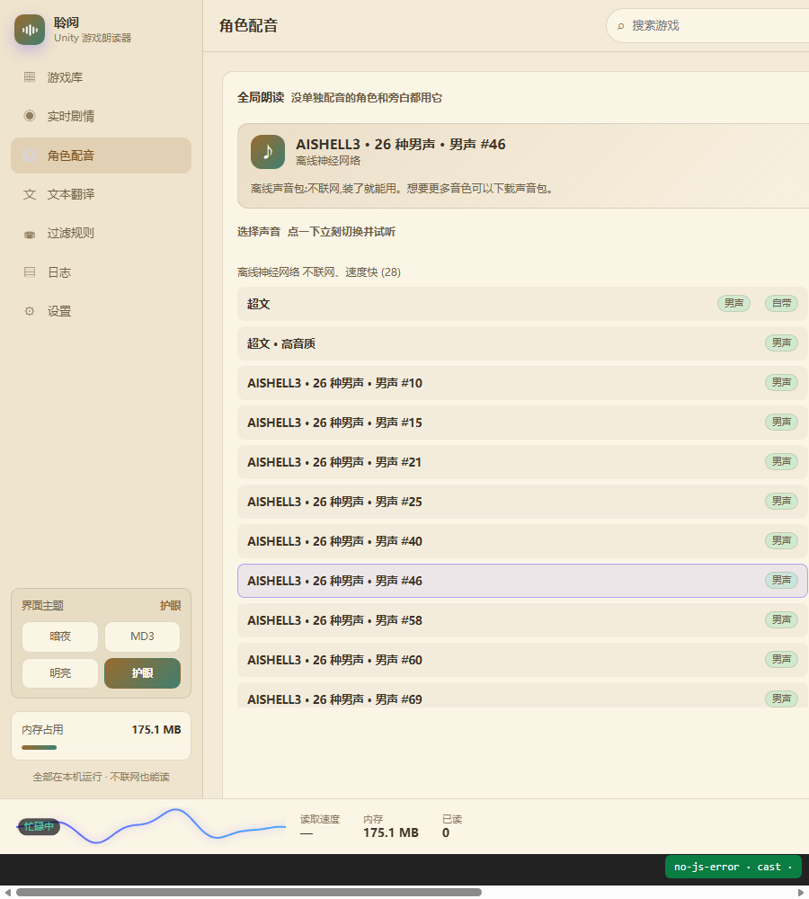
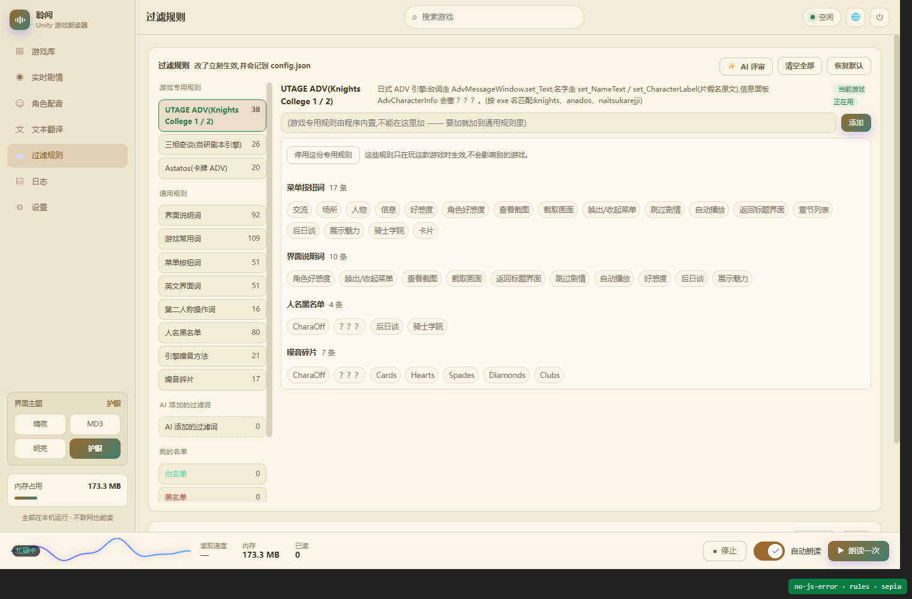

# 界面截图集

README 只放了三张,这里是完整的一套(四套主题、各个页面、安装程序)。

## 主界面

| 游戏库 | 实时剧情 |
|---|---|
|  |  |

| 角色配音 | 文本翻译 |
|---|---|
|  |  |

| 过滤规则(按游戏分档案) | 日志 |
|---|---|
|  |  |

| 设置 | 语音包下载 |
|---|---|
|  |  |

| 黑白名单弹窗 | 窄窗口自适应 |
|---|---|
|  |  |

## 四套主题

| MD3(Material 3) | 暗夜 |
|---|---|
|  |  |

| 护眼 | 悬浮窗(四套主题配色对照) |
|---|---|
|  |  |

主题切换时**窗口底色、标题栏、悬浮窗**会一起变(由窗口宿主通过 `DwmSetWindowAttribute` 与 WebView2 背景色同步)。

## 安装程序 / 卸载程序

| 安装程序(网页界面) | 卸载程序(网页界面) |
|---|---|
|  |  |

两者都由 WebView2 渲染同一套设计语言;机器上没有 WebView2 运行时会**自动回退**到 Win32 自绘界面,功能不受影响。

## 悬浮窗设计稿

`悬浮窗设计图/` 目录里是早期设计稿(胶囊态与卡片态的尺寸、间距、配色标注)。
